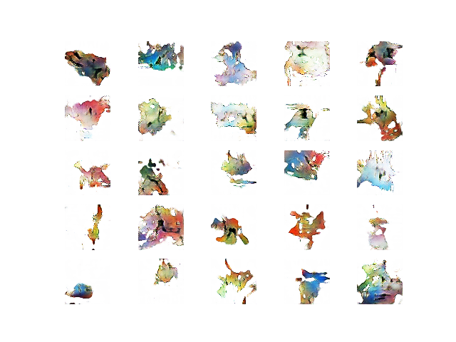
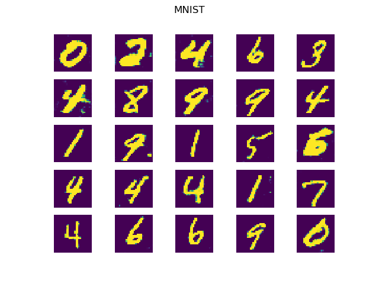

# Pokemon Generator

PLEASE README BEFORE LOOKING AT CODE: THIS EXPLAINS IMPORTANT SETUP STEPS AND EXPLAINS THE STRUCTURE OF THIS CODEBASE.



*An example of generated pokemon*



*An example of MNIST style digits generated using the wgan-gp*

This is the codebase for my COMP3419 assignment, to generate pokemon with WGANs. To install all dependencies, simply run ```pip install -r requirements.txt```. However, if you wish to use GPU training, please remove tensorflow from the dependencies list in ```requirements.txt``` and install tensorflow-gpu on your own. To make sure you can run the WGAN-GP training, which requires second order gradients in some cases, ensure you have the latest versions of CUDnn and tensorflow-gpu installed.

I'd highly recommend using GPU training if you can - it vastly speeds up training, and making results a matter of days instead of a matter of hours.

Before running any code, you also need to download and correctly preprocess the datasets I used. Keras automatically handles downloading the MNIST dataset, so you don't need to worry about that. For the AD20K dataset, used for testing semantic segmentation, please download it from [here](https://groups.csail.mit.edu/vision/datasets/ADE20K/). You will then have to reformat the layout of this dataset: place it into a folder called ```segmentation_dataset``` with one subfolder: ```images```. Inside ```images``` There should be 3 folders: ```masks```, which contains all segmentation masks of the training set in order; ```raws```, which contains all raw images of the dataset in order; ```test```, which again contains two folders,  ```raws``` and ```masks```, which contains the raw images and segmentation masks of the test dataset respectively. Look at ```utils/data_move.py``` for some help in doing this in code. Finally, download the Sugimori art dataset from [veekun](https://veekun.com/static/pokedex/downloads/pokemon-sugimori.tar.gz), and place this in a folder called ```data/pokemon```. You will also have to convert all these images from RGBA to RGB - look at ```utils/rgba_to_rgb.py``` for help with this. Once these datasets are correctly downloaded and sorted, you should be able to run the demo and training programs without issues.

If you just want to see results, please run ```demo.py```. Otherwise, check ```wgan.py``` and ```improved_wgan.py``` for the training code. In particular, both import functions to create generator and discriminator models. By changing the function used, you can change the WGAN configuration. Other changeable parameters are listed in the top of the files, in capitals. Ensure that all directories arftifacts are saved into exist, otherwise there will be errors when running the code.

Note that Keras will warn about a "discrepancy between trainable weights and collected trainable weights" - please ignore this as this error is intended for users who do not need to reuse models in different setups with different trainable layers, as is the case with GANs.

Note no video was included in my submission as [this](https://edstem.org/courses/2893/discussion/111135) Ed post indicated it was not necessary.

## Code overview

- ```report.pdf```: My report.

- ```utils```: various utility functions for experimentation. ```data_move.py``` helped with moving files into appropriate directories when dealing with the AD20K dataset. ```rgba_to_rgb.py``` converts all images in a folder from RGBA to RGB. This was required as pokémon images were usually RGBA. ```loss_plot.py``` turns a log file into a graph. Log files were of the format "[iteration] [discriminator loss] [generator loss]", with each iteration on a new line. This program was used to generate the graphs seen in the report.

- ```weights```: Various weights from the experiments. Generator weights can be used to reproduce images. These weights are used in the demo program.

- ```alt_gen.py```: The baseline generator, with deconvolution layers. Run the file to train and then test it on the AD20K dataset for semantic segmentation.

- ```generator.py```: The improved generator, with convolution and upsampling layers. Run the file to train and then test it on the AD20K dataset for semantic segmentation.

- ```discriminator.py```: The baseline discriminator. Run this file to train and test it on the MNIST dataset.

- ```resnet_disc.py```: The resnet discriminator. Run this file to train and test it on the MNIST dataset.

- ```wgan.py```: The WGAN training code. Change the ```make_generator``` and ```make_discriminator``` functions to other model building functions found in the above files to test on different configurations.

- ```improved_wgan.py```: The WGAN-GP training code. Change the ```make_generator``` and ```make_discriminator``` functions to other model building functions found in the above files to test on different configurations.

- ```data_prep.py```: The data preparation code. Run it to see the results of data preparation (please make sure there is a local directory called ```transform``` before running the code).

- ```demo.py```: The demo code. Run this to see the results of different WGANs and the individual results of each architecture. This requires the segmentation dataset has been downloaded and correctly sorted. If you cannot do this, simply comment out the AD20K tests in the code.