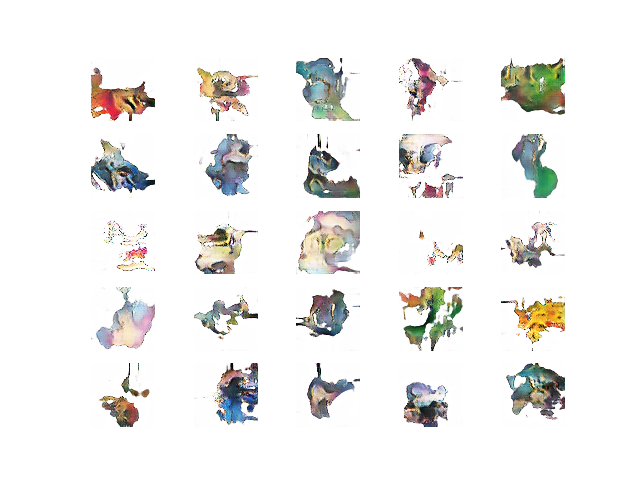
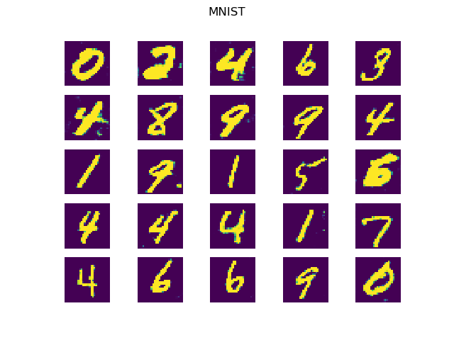
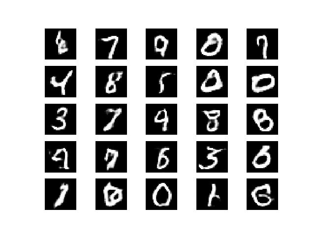
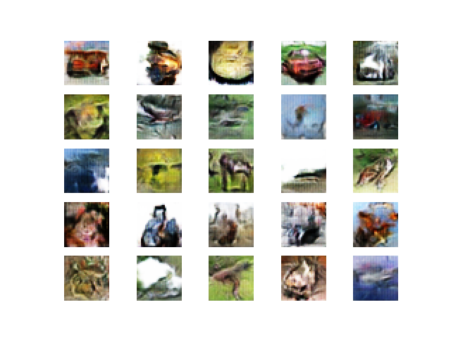
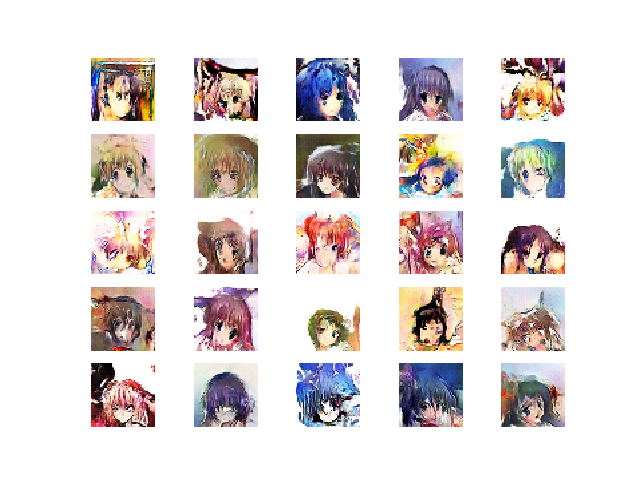
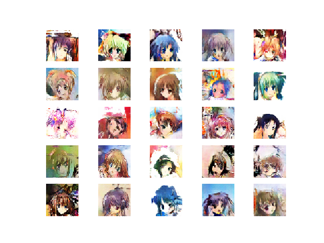
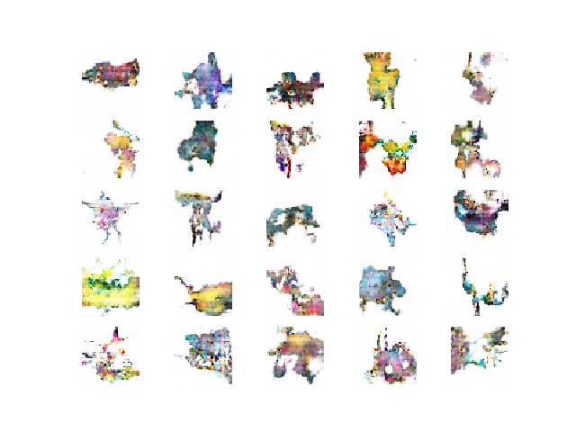

# Pokemon Generator



*An example of generated pokemon, from 6750 iterations of training with a WGAN-GP*

Hi! This is my light implementation of a WGAN and WGAN-GP in Keras. I've cobbled together much code from around the place, so make sure to read the comments on my code to see where I got architectures/implementation details from. I'll put a list of repositories I found useful below. Originally, this was a university assignment, but once the assignment ended I pushed it futher to see if I could generate other sorts of images, such as mnist:





*An example of MNIST style digits generated using the wgan-gp. The lower image was from only 2,100 iterations of training!*

I also had a go at the CIFAR-10 dataset:



*An example of images generated using the wgan-gp and the CIFAR dataset (10,000 iterations).*

And anime faces:





*Examples of images generated using an anime face dataset. The top one is is from 50,000 iterations of training, and the lower from 10,000 iterations.*

I also tried a different setup for pokemon generation, with mostly similar results:



*An example of generated images using an alternate setup for generating pokemon images (6750 iterations)*

There are 5 main models I trained and wrote up:

- Models trained on a pokemon Sugimori art dataset, generating 128x128 images. I trained two models using this setup: one with the vanilla WGAN algorithm, and the other with the WGAN-GP algorithm.
- A model trained on the pokemon Sugimori art dataset, but generatig 48x48 images, using the WGAN-GP algorithm.
- A model trained on the MNIST dataset, using the WGAN-GP algorithm.
- A model trained on the CIFAR-10 dataset, using the WGAN-GP algorithm.
- A model trained on an anime face dataset (see below for details), generating 48x48 images, using the WGAN-GP algorithm.

## Running This Yourself

In this repo, I have included the weights used to generate the above images, in the ```weights``` folder. To check this out, simply install the dependencies (keras, tensorflow, etc - a simple ```pip install -r requirements.txt``` should be enough) and run ```demo.py```! This should be runnable without needing some beefy GPU - it runs alright-ish on my little 2015 MacBook.
  
## Training This Yourself

Firstly, training these models takes a long time! Even mnist takes at least an hour or two, with GPU training. So make sure you're using a GPU, and ready to run these programs for a while. Also, make sure to install the dependencies (```pip install -r requirements.txt```). If you're using a GPU, make sure to install ```tensorflow-gpu``` rather than ```tensorflow``` (which is in the requirements file currently).

Firstly, before running any code, you will need to download and correctly preprocess the datasets I used. Keras automatically handles downloading the MNIST and CIFAR datasets, so you don't need to worry about that. For the pokemon images, download the Sugimori art dataset from [veekun](https://veekun.com/static/pokedex/downloads/pokemon-sugimori.tar.gz), and place this in a folder called ```data/pokemon```. You will also have to convert all these images from RGBA to RGB - look at ```utils/rgba_to_rgb.py``` for help with this. Once these datasets are correctly downloaded and sorted, you should be able to run the demo and training programs without issues. For the Anime face images, I used the dataset found [here](http://www.nurs.or.jp/~nagadomi/animeface-character-dataset/). Again, you'll need to convert these to jpeg images and place the face images into a folder called ```data/animeface-character-dataset-thumb```. 

Once the data has been prepared, you can run the training! For the Vanilla WGAN model, just run ```wgan.py``` - it will train the model. Make sure you take a look in the code to change the constants at the top - set where the weights, images, and logs get saved. By default, these get saved into folders called ```weights```, ```results```, and ```logs``` respectively, so at least make sure these folders exist. To run the other models, you'll be running ```improved_wgan.py```. This defaults to training the pokemon model (training on the pokemon dataset), but can be changed to other datasets by giving a command line argument as such: ```python improved_wgan.py <arg>```. The possible arguments are:

- ```mnist```: Train the MNIST model.
- ```cifar```: Train the CIFAR-10 model.
- ```anime```: Train the anime-face model.
- ```pokemon-alt```: Train the alternate pokemon model.

Note that Keras will warn about a "discrepancy between trainable weights and collected trainable weights" - please ignore this as this error is intended for users who do not need to reuse models in different setups with different trainable layers, as is the case with GANs.

## Quick Code Overview

Here's a quick description of each file with code:

- ```utils```: various utility functions for experimentation. ```rgba_to_rgb.py``` converts all images in a folder from RGBA to RGB. This was required as pokémon images were usually RGBA. ```loss_plot.py``` turns a log file into a graph. Log files were of the format "[iteration] [discriminator loss] [generator loss]", with each iteration on a new line. This program was used to generate the graphs seen in the report.

- ```weights```: Various weights from the experiments. Generator weights can be used to reproduce images. These weights are used in the demo program. See the readme in the folder for more details.

- ```alt_gen.py```: The generators for the non-pokemon models, using deconvolution layers.

- ```generator.py```: The generator for the pokemon model, using convolution and upsampling layers.

- ```discriminator.py```: The discriminators for the models. The normal pokemon model uses ```make_poke_discriminator```, and all other models use ```make_discriminator```.

- ```wgan.py```: The WGAN training code. This imports discriminator/critic architectures from the above files and runs the vanilla WGAN algorithm. Only used for the pokemon model.

- ```improved_wgan.py```: The WGAN-GP training code. Used for most of the models.

- ```data_prep.py```: The data preparation code for the various datasets. Run it to see the results of data preparation (please make sure there is a local directory called ```transform``` before running the code).

- ```demo.py```: The demo code. Run this to see the results of different models, using the pre-trained weights.
